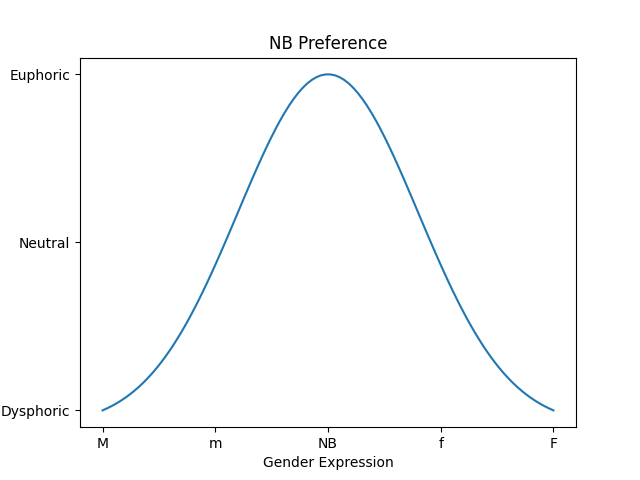
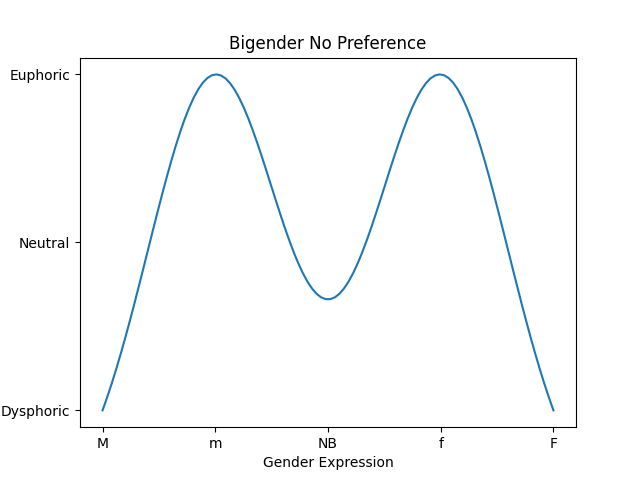
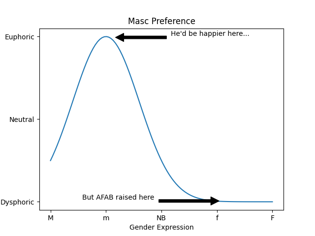

# Stress Vs Gender Identity Explanations

Gender is a complex multi-faceted expression of many factors not fully captured by a binary "Female" or "Male".  It is still a gross simplification, but suppose we would project what we call gender to a single dimension from Masculine (on the left, say) to Feminine (on the right).  On the far left is ultra masculine, to use western stereotypes: loving sports, excessive drinking, body hair, giving strong handshakes, etc.  As we move to the right, these behaviors moderate and become more feminine (again, to use stereotypes: wearing dresses, being more emotionally supportive, being a mom, speaking with a higher pitch, etc).

```
<-Very Masc----Masc----Non Binary----Fem----Very Fem->
```

Consider where you might be on this axis.  Do you present mostly female, but not entirely?  Do behaviors/traits associated with other parts of the spectrum make you uncomfortable?  For example, maybe you are a woman but have some amount of body hair.  Whenever you notice it, you experience stress from something that is associated with being masculine.  Or maybe there was a time you were forced to wear a dress, something more feminine than you prefer.

At different places on the gender identity spectrum, you may experience different levels of stress.  Or if you prefer to think positively, you experience different levels of happiness.  Perhaps if you identify as female, your Stress-Gender curve looks like this:


Just to give some examples, if you're non-binary, maybe your point of minimum stress shifts left (again, this is a simplification!).



Of course, gender identity can be more complex than this.  Perhaps you are somewhat comfortable with both male and female traits, but the space in between is uncomfortable.  This is a form of *bigender*:



Even in this situation, one might still have lower stress in one place on the gender spectrum.  Perhaps you are bigender with a female preference:


Of course, you may have multiple prefences (i.e. local minima).  Maybe you're multi-gender with a stress-gender curve like this:


One thing this curve fails to capture is Genderfluid.  In that situation, you may have a particular stress-gender curve, but it changes in time.  One week it could be masculine preferring, and the next it could be bigender with feminine preference.  It is *dynamic in time*.

Further, these kind of diagrams combine many internal and *external* factors.  The society you live in may make life difficult for certain gender identities (e.g. making women second-class citizens, ignoring the existence of non-binary identities, etc).  But, it's still important to understand what your *internal* curve is, so if necessary, you can change yourself or your environment as needed.

# What If You're Trans?

So far, we've only talked about what stress you *would* experience with different gender expression.  But what if you are living at one place on the spectrum (due to cultural norms, medical situations, or whatever), but you'd have a lower stress at another place?

For example, perhaps you were AFAB, but you know you have a masculine gender-identity.  You may be stressed by having to live as a woman (perhaps you cannot safely transition nor socially present as male).  



A similar situation can arise for bi/multi-gender individuals.  Again, consider if you're AMAB and bigender with a female preference.  Maybe you've been living as a man (because you hadn't figured out your gender identity, say), but realized what your stress-gender curve actually is.  Sure, you *could* continue presenting male; it wouldn't be as miserable as for the above trans man forced to present female.  But you're not living life to its fullest; and you'd be living with a constant stress just from existing.  If you can transition to a more feminine state, you may realize lower stress, more happiness, and more fulfillment.


# How Do I Figure Out My Stress-Gender Curve?

This is similar to the question of "How do I determine if I am trans?"  Most cis-gendered people are comfortable in their assigned gender, so even asking the question suggests you may not be living at your *global* minimum for stress.

There is not yet a standardized set of experiments/questions to determine your curve (online quiz in the works!).  But you can run your own experiments, be they mental exercises (e.g. "What if I wore a bra?"/"What if had a beard?") or physical tests (e.g. wearing a dress, using different pronouns, etc).

As you do so, consider where each test would put you on the gender spectrum, and how much stress you feel from it.  Start plotting these points.  Over time, you will be see approximately where you curve lies as you explore the stress-gender space.

Recommended Resource: [You And Your Gender Identity](https://discoveryourgenderidentity.com/wp-content/uploads/woocommerce_uploads/2016/06/YOUANDYOURGENDERIDENTITY.pdf) by Dara Hoffman-Fox
