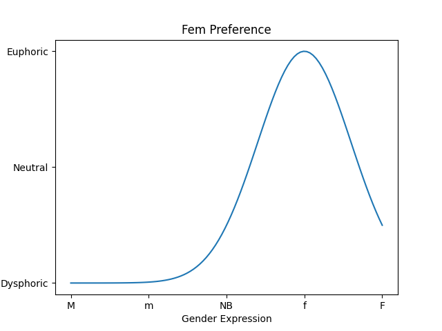
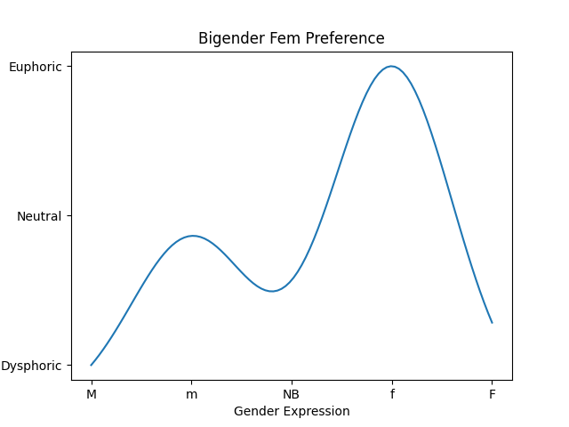

# Stress vs Gender Identity Explanations

Gender is a complex multi-faceted expression of many factors not fully captured by a binary "Female" or "Male".  It is still a gross simplification, but suppose we would project what we call gender to a single dimension from Masculine (on the left, say) to Feminine (on the right).  On the far left is ultra masculine, to use western stereotypes: loving sports, excessive drinking, body hair, giving strong handshakes, etc.  As we move to the right, these behaviors moderate and become more feminine (again, to use stereotypes: wearing dresses, being more emotionally supportive, being a mom, speaking with a higher pitch, etc).

```
<-Very Masc----Masc----Non Binary----Fem----Very Fem->
```

Consider where you might be on this axis.  Do you present mostly female, but not entirely?  Do behaviors/traits associated with other parts of the spectrum make you uncomfortable?  For example, maybe you are a woman but have some amount of body hair.  Whenever you notice it, you experience stress from something that is associated with being masculine.  Or maybe there was a time you were forced to wear a dress, something more feminine than you prefer.

At different places on the gender identity spectrum, you may experience different levels of stress.  Or if you prefer to think positively, you experience different levels of happiness.  Perhaps if you identify as female, your Stress-Gender curve looks like this:



Just to give some examples, if you're non-binary, maybe your point of minimum stress shifts left (again, this is a simplification!).


Of course, gender identity can be more complex than this.  Perhaps you are somewhat comfortable with both male and female traits, but the space in between is uncomfortable.  This is a form of *bigender*:


Even in this situation, one might still have lower stress in one place on the gender spectrum.  Perhaps you are bigender with a female preference:



One thing this curve fails to capture is Genderfluid.  In that situation, you may have a particular stress-gender curve, but it changes in time.  One week it could be masculine preferring, and the next it could be bigender with feminine preference.  It is *dynamic in time*.

# What if You're Trans?

So far, we've only talked about what stress you *would* experience with different gender expression.  But what if you are living at one place on the spectrum (due to cultural norms, medical situations, or whatever), but you'd have a lower stress at another place?

For example, perhaps you were AFAB
